# Slider Otomasyon Sistemi - Mimari Diyagramlar

## 🏗️ Sistem Mimarisi

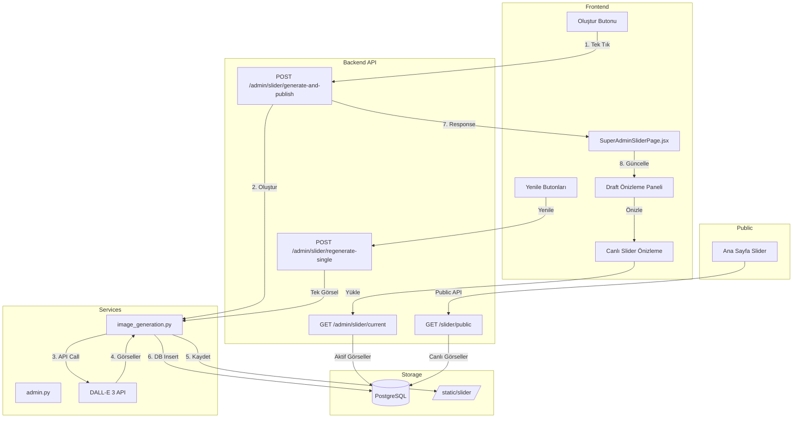

## 🔄 İş Akışı Diyagramı

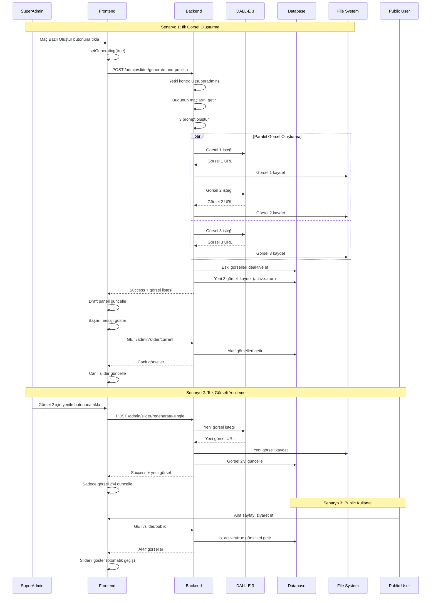

## 🗄️ Veritabanı Şeması

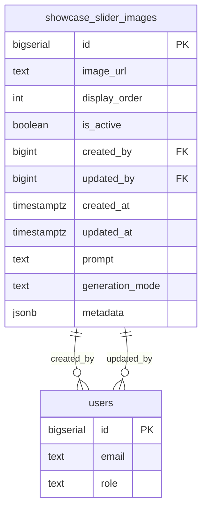

## 📊 State Yönetimi

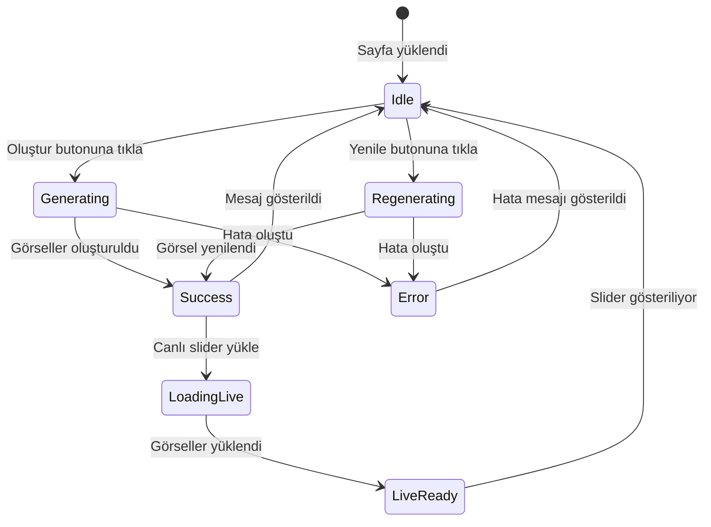

## 🎯 Component Hiyerarşisi

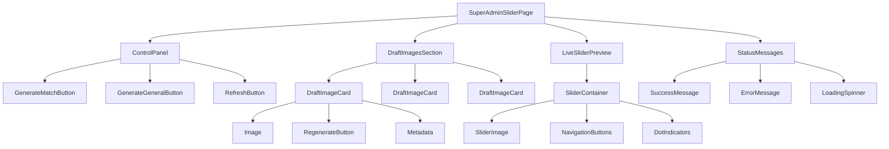

## 🔐 Güvenlik Akışı

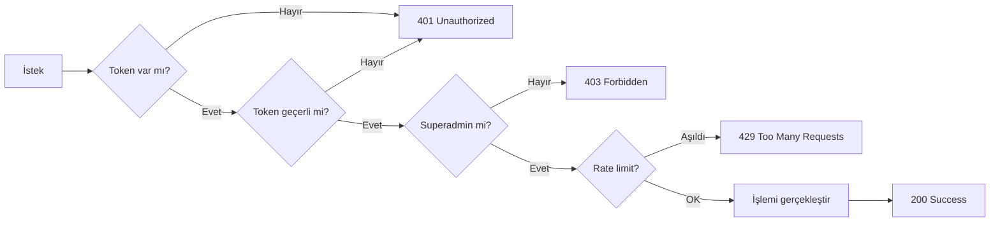

## 📈 Performans Optimizasyonu

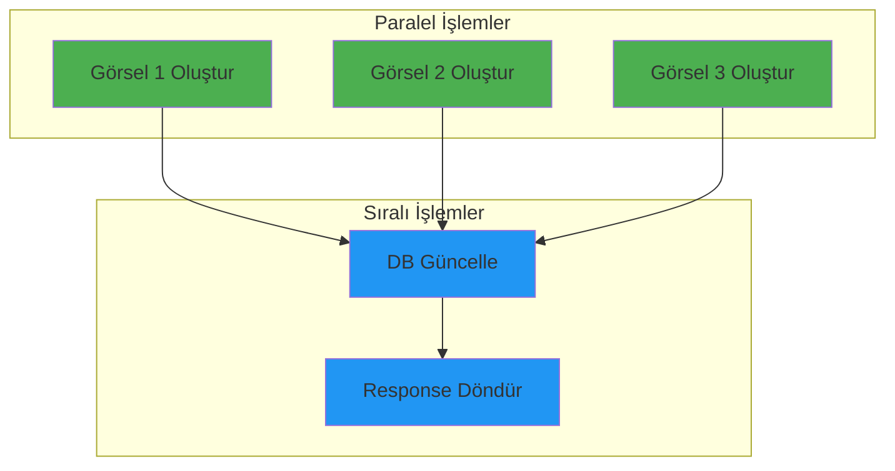

## 🎨 UI Component Yapısı

```
SuperAdminSliderPage
├── Header
│   ├── Title: "Slider Yönetimi"
│   └── Breadcrumb: Admin > Slider
│
├── ControlPanel
│   ├── GenerateMatchButton
│   │   ├── Icon: 🏆
│   │   ├── Text: "Maç Bazlı Oluştur"
│   │   └── Loading State
│   │
│   └── GenerateGeneralButton
│       ├── Icon: 🎨
│       ├── Text: "Genel Tasarım Oluştur"
│       └── Loading State
│
├── StatusMessages
│   ├── SuccessMessage (conditional)
│   ├── ErrorMessage (conditional)
│   └── InfoMessage (conditional)
│
├── DraftSection
│   ├── SectionTitle: "Oluşturulan Görseller"
│   ├── Grid (3 columns)
│   │   ├── DraftCard 1
│   │   │   ├── Image
│   │   │   ├── Metadata (prompt, created_at)
│   │   │   └── RegenerateButton
│   │   │
│   │   ├── DraftCard 2
│   │   └── DraftCard 3
│   │
│   └── EmptyState (if no images)
│
└── LivePreviewSection
    ├── SectionTitle: "Canlı Slider Önizleme"
    ├── SliderContainer
    │   ├── SliderImage (active)
    │   ├── PrevButton
    │   ├── NextButton
    │   └── DotIndicators
    │
    └── RefreshButton
```

## 🔄 Data Flow

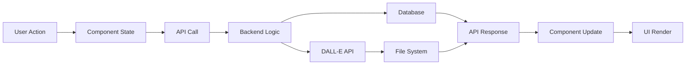

## 📱 Responsive Breakpoints

```
Desktop (>1200px)
├── 3 column grid for draft images
├── Full width slider preview
└── Side-by-side buttons

Tablet (768px - 1200px)
├── 2 column grid for draft images
├── Full width slider preview
└── Stacked buttons

Mobile (<768px)
├── 1 column grid for draft images
├── Full width slider preview
└── Stacked buttons (full width)
```

## 🧪 Test Coverage

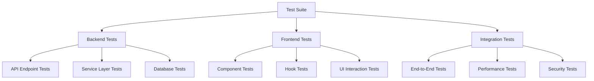

## 📊 Monitoring & Logging

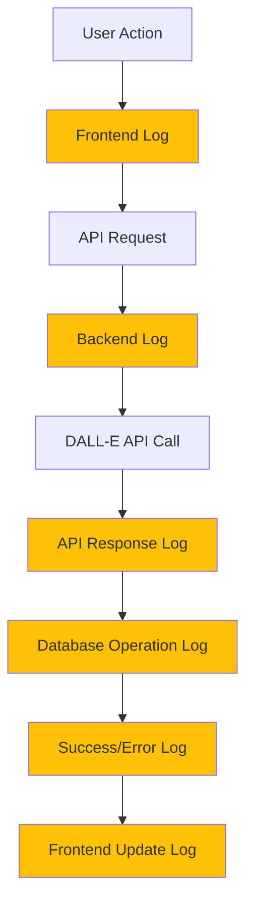

## 🚀 Deployment Pipeline

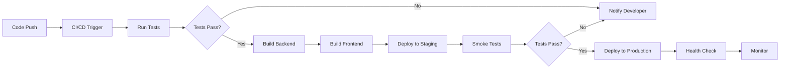
